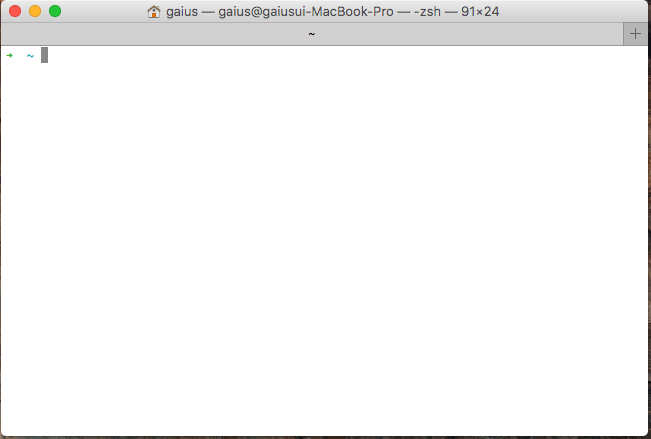
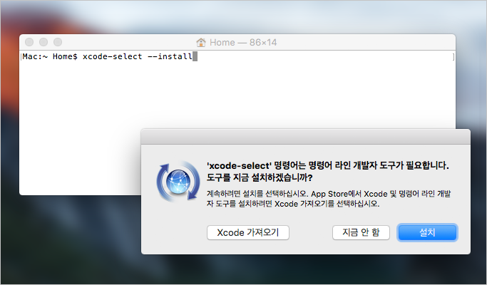
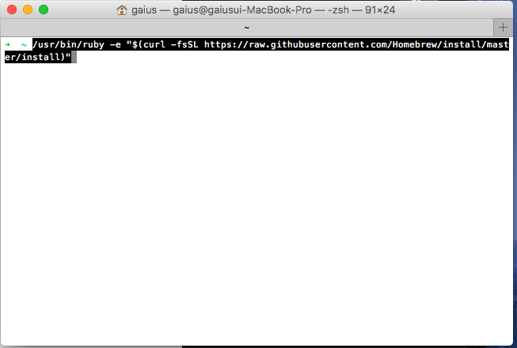
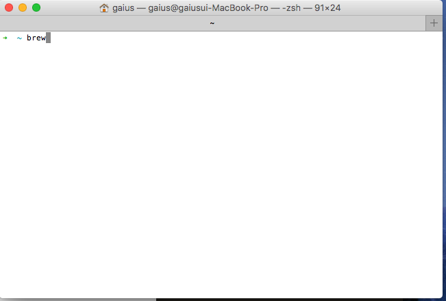
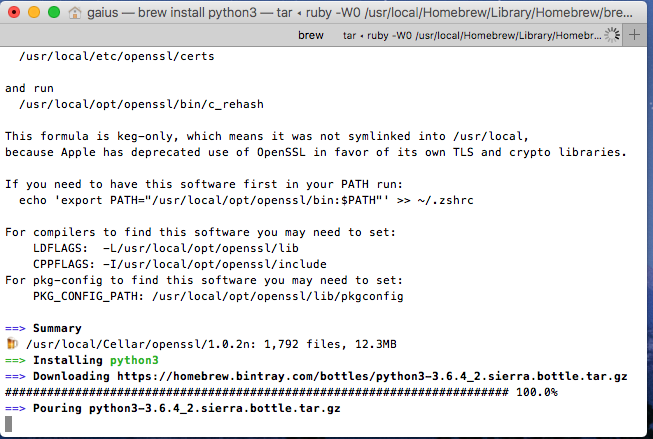

#  python & pycharm 설치법(mac ver)

Mac 사용자가 python을 사용하기 위한 설치과정을 소개합니다. 파이썬 설치부터 pycharm을 통한 python 파일(.py) 실행까지의 과정을 담고 있습니다.


## index

* Mac의 터미널 이해
* Home-brew 설치 및 python 설치
* IDE(pycharm) 다운로드 및 설치
* pycharm에서 파이썬 파일 만들고 실행해보기


## Mac의 터미널 실행하기

 터미널은 <u>컴퓨터 사용자와 컴퓨터끼지 명령과 그 수행결과를 주고 받을 수 있도록 해주는 도구</u> 정도로 이해해주시면 되겠습니다. 기본적으로 내장된 명령어를 입력하면 컴퓨터가 그 명령어를 해석해서 바로 수행하는 것이지요. 파이썬 개발에 있어서도 터미널 작업은 뗄레야 뗄수 없는 부분이기 때문에 터미널 사용이 익숙해지면 여러모로 편합니다. 

 거두절미하고 바로 맥의 터미널을 사용해보겠습니다.


#### spotlight로 terminal 실행

 Mac에는 spotlight라는 shortcut(단축키) 기능이 있습니다. 먼저 spotlight기능을 사용하기 위해서 해당 단축키를 한번 알아봅시다. (굳이 spotlight를 사용하는 이유는 마우스를 안 쓰려는 개발자의 습성이…… 그냥 f4 > 검색창에 terminal 하셔도 상관은 없습니다.)

 맥의 환경설정 > 키보드 > 단축키 > spotlight 순으로 클릭하여 단축키가 뭔지 알아봅니다.

필자는 커멘드 + 스페이스입니다.(맥의 OS 버전이나 사용자의 임의 설정에 따라 단축키가 다를 수 있습니다.)


단축키를 확인한 후 spotlight를 실행하면


이런식으로 검색창이 하나 뜨는데, 여기에다 실행할 어플리케이션(프로그램)을 입력하면 맥이 알아서 해당 어플리케이션을 찾아서 실행해 줍니다.

우리는 내장된 터미널을 실행하고 싶은 것이므로 `터미널` 혹은 `terminal`을 입력하고 `enter`를 쳐보도록 합니다.



이렇게 맥의 기본터미널이 실행되었다면 성공입니다!


## Homebrew 설치 및 python 설치

#### Homebrew 설치

 Homebrew는 macOS용 패키지 관리자입니다. 패키지 관리자란 <u>프로그램을 설치 및 업데이트, 삭제 등을 관리해주는 역할</u>을 합니다. 보통 일반적인 사용자라면 그냥 완성된 프로그램이나 패키지를 사용하기 때문에 패키지 관리자가 따로 필요하지 않고, 그냥 필요한 프로그램을 따로 다운로드 받아서 설치하는 것으로 만족할 것입니다. 하지만 개발자들은 코딩을 위해서 수많은 패키지를 사용하게 되고 해당 패키지가 또 다른 개발자들에 의해서 수없이 업데이트 되기를 반복하기 때문에, 이를 효율적으로 관리할 툴이 필요한 것이죠. Mac에서 그 대표적인 패키지 관리자 역할을 수행하는 것이 바로 Homebrew입니다. 다시말해서, Homebrew를 사용하면 내가 사용하는 패키지의 설치, 업데이트의 상당부분이 자동화됨을 의미합니다. 우리는 이 homebrew를 이용해서 파이썬을 단 한줄로 설치할 것입니다!

 일단 homebrew를 설치하려면 Xcode의 Command Line Tools이 필요합니다.(이미 Xcode가 설치되어 있다면 본 과정은 넘기셔도 됩니다.) 이는 우리가 터미널에 입력하는 명령어를수행할 수 있게 하는 패키지입니다. 설치법은 맥의 기본터미널에서 `xcode-select --install`를 입력하고 설치버튼을 누르기만 하면 쉽게 설치 할 수 있습니다.




Command line Tools를 설치하셨다면 터미널을 종료(command + q) 하신 후 다시 터미널을 실행하시고 homebrew를 설치해 줍니다. homebrew 설치 명령어(아래)를 그대로 복사 붙여넣기 하신후 `enter`를 치시면 되겠습니다~

```
/usr/bin/ruby -e "$(curl -fsSL https://raw.githubusercontent.com/Homebrew/install/master/install)"
```




homebrew 설치가 완료되면, `brew` 명령어를 한번 입력해서 제대로 설치됐는지 확인합니다.


이런식으로 brew와 관련된 명령어 사용법이 나온다면 제대로 설치된 것입니다.


#### python 설치

 Mac에는 기본적으로 python이 설치되어 있지만, 이게 python2 버전입니다. 가장 최신 버전은 python3 버전인데, 이게 python2 버전과 문법적인 차이가 있고, 사용할 수 있는 라이브러리도 차이가 있기 때문에 우리는 python3를 새롭게 설치할 것입니다.

설치한 Homebrew를 이용해서 python3 버전을 설치해 봅시다.


터미널에 `brew install python3`를 입력하기만 하면 brew가 python 패키지를 알아서 다운로드 받아서 설치까지 해줄 것입니다. 



우리의 똑똑한 homebrew가 python3 관련된 패키지를 다운받아 설치하고 있습니다.


파이썬 설치를 완료한 화면


python3 버전이 제대로 설치되었는지 확인하는 방법은


위와 같이 터미널에 `python3`를 입력하고


위와 같은 화면이 나온 것을 확인하시면 설치가 정상적으로 완료된 것입니다.(나오실 땐 `exit()`을 입력하시면 됩니다.) 


