#  python & pycharm 설치법(mac ver)

Mac 사용자가 python을 사용하기 위한 설치과정을 소개합니다. 파이썬 설치부터 pycharm을 통한 python 파일(.py) 실행까지의 과정을 담고 있습니다.


## index

* Mac의 터미널 이해
* Home-brew 설치 및 python 설치
* IDE(pycharm) 다운로드 및 설치
* pycharm에서 파이썬 파일 만들고 실행해보기


## Mac의 터미널 실행하기

 터미널은 <u>컴퓨터 사용자와 컴퓨터끼지 명령과 그 수행결과를 주고 받을 수 있도록 해주는 도구</u> 정도로 이해해주시면 되겠습니다. 기본적으로 내장된 명령어를 입력하면 컴퓨터가 그 명령어를 해석해서 바로 수행하는 것이지요. 파이썬 개발에 있어서도 터미널 작업은 뗄레야 뗄수 없는 부분이기 때문에 터미널 사용이 익숙해지면 여러모로 편합니다. 

 거두절미하고 바로 맥의 터미널을 사용해보겠습니다.


#### spotlight로 terminal 실행

 Mac에는 spotlight라는 shortcut(단축키) 기능이 있습니다. 먼저 spotlight기능을 사용하기 위해서 해당 단축키를 한번 알아봅시다. (굳이 spotlight를 사용하는 이유는 마우스를 안 쓰려는 개발자의 습성이…… 그냥 f4 > 검색창에 terminal 하셔도 상관은 없습니다.)

 맥의 환경설정 > 키보드 > 단축키 > spotlight 순으로 클릭하여 단축키가 뭔지 알아봅니다.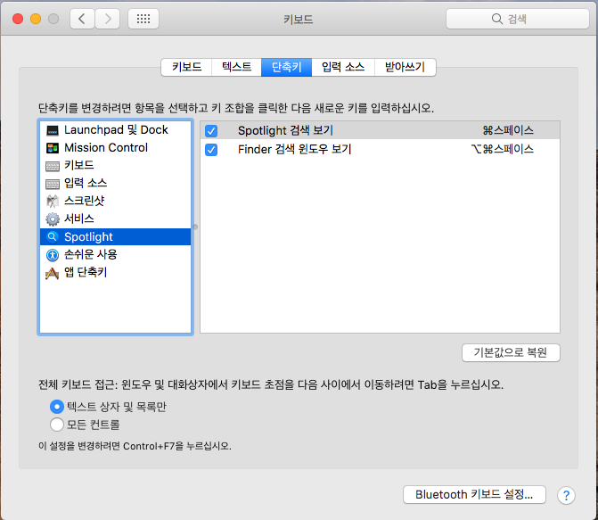

필자는 커멘드 + 스페이스입니다.(맥의 OS 버전이나 사용자의 임의 설정에 따라 단축키가 다를 수 있습니다.)


단축키를 확인한 후 spotlight를 실행하면


이런식으로 검색창이 하나 뜨는데, 여기에다 실행할 어플리케이션(프로그램)을 입력하면 맥이 알아서 해당 어플리케이션을 찾아서 실행해 줍니다.

우리는 내장된 터미널을 실행하고 싶은 것이므로 `터미널` 혹은 `terminal`을 입력하고 `enter`를 쳐보도록 합니다.


이렇게 맥의 기본터미널이 실행되었다면 성공입니다!


## Homebrew 설치 및 python 설치

#### Homebrew 설치

 Homebrew는 macOS용 패키지 관리자입니다. 패키지 관리자란 <u>프로그램을 설치 및 업데이트, 삭제 등을 관리해주는 역할</u>을 합니다. 보통 일반적인 사용자라면 그냥 완성된 프로그램이나 패키지를 사용하기 때문에 패키지 관리자가 따로 필요하지 않고, 그냥 필요한 프로그램을 따로 다운로드 받아서 설치하는 것으로 만족할 것입니다. 하지만 개발자들은 코딩을 위해서 수많은 패키지를 사용하게 되고 해당 패키지가 또 다른 개발자들에 의해서 수없이 업데이트 되기를 반복하기 때문에, 이를 효율적으로 관리할 툴이 필요한 것이죠. Mac에서 그 대표적인 패키지 관리자 역할을 수행하는 것이 바로 Homebrew입니다. 다시말해서, Homebrew를 사용하면 내가 사용하는 패키지의 설치, 업데이트의 상당부분이 자동화됨을 의미합니다. 우리는 이 homebrew를 이용해서 파이썬을 단 한줄로 설치할 것입니다!

 일단 homebrew를 설치하려면 Xcode의 Command Line Tools이 필요합니다.(이미 Xcode가 설치되어 있다면 본 과정은 넘기셔도 됩니다.) 이는 우리가 터미널에 입력하는 명령어를수행할 수 있게 하는 패키지입니다. 설치법은 맥의 기본터미널에서 `xcode-select --install`를 입력하고 설치버튼을 누르기만 하면 쉽게 설치 할 수 있습니다.


Command line Tools를 설치하셨다면 터미널을 종료(command + q) 하신 후 다시 터미널을 실행하시고 homebrew를 설치해 줍니다. homebrew 설치 명령어(아래)를 그대로 복사 붙여넣기 하신후 `enter`를 치시면 되겠습니다~

```
/usr/bin/ruby -e "$(curl -fsSL https://raw.githubusercontent.com/Homebrew/install/master/install)"
```


homebrew 설치가 완료되면, `brew` 명령어를 한번 입력해서 제대로 설치됐는지 확인합니다.


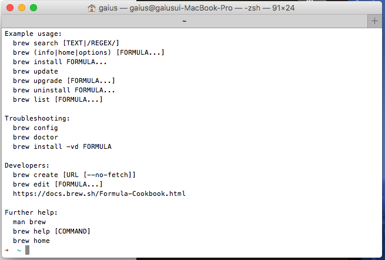

이런식으로 brew와 관련된 명령어 사용법이 나온다면 제대로 설치된 것입니다.


#### python 설치

 Mac에는 기본적으로 python이 설치되어 있지만, 이게 python2 버전입니다. 가장 최신 버전은 python3 버전인데, 이게 python2 버전과 문법적인 차이가 있고, 사용할 수 있는 라이브러리도 차이가 있기 때문에 우리는 python3를 새롭게 설치할 것입니다.

설치한 Homebrew를 이용해서 python3 버전을 설치해 봅시다.

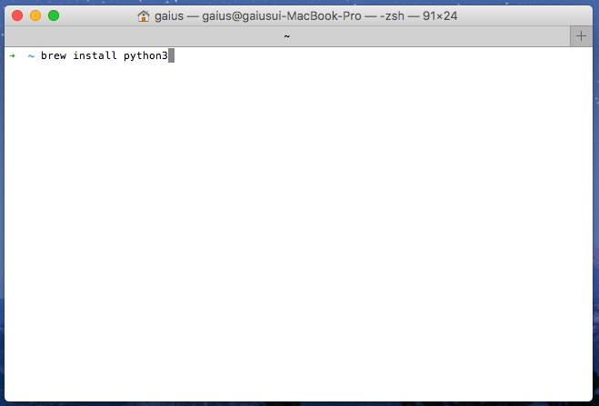

터미널에 `brew install python3`를 입력하기만 하면 brew가 python 패키지를 알아서 다운로드 받아서 설치까지 해줄 것입니다. 


우리의 똑똑한 homebrew가 python3 관련된 패키지를 다운받아 설치하고 있습니다.


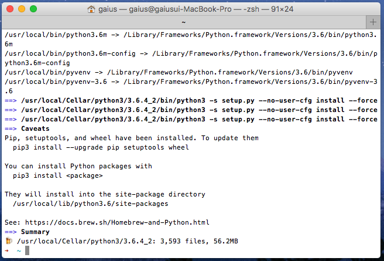

파이썬 설치를 완료한 화면


python3 버전이 제대로 설치되었는지 확인하는 방법은

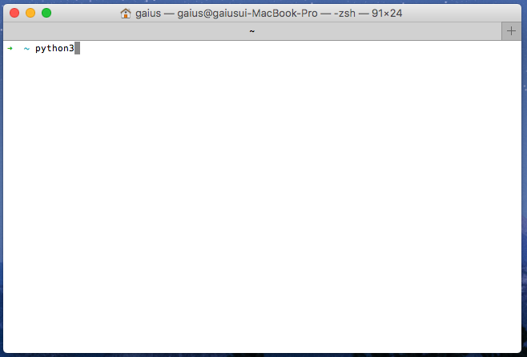

위와 같이 터미널에 `python3`를 입력하고


위와 같은 화면이 나온 것을 확인하시면 설치가 정상적으로 완료된 것입니다.(나오실 땐 `exit()`을 입력하시면 됩니다.) 


## pycharm 설치하기

##### pycharm(파이참)? IDE?

 파이참은 jetbrains사에서 판매하는 IDE 프로그램입니다. <a href='https://ko.wikipedia.org/wiki/%ED%86%B5%ED%95%A9_%EA%B0%9C%EB%B0%9C_%ED%99%98%EA%B2%BD'>IDE(Integrated Development Environment)</a> 프로그램을 쉽게 이야기하면 프로그램을 만드는 여러 과정들을 한 곳에서 모두 할 수 있도록 모아놓은 툴이라 할 수 있습니다. 사실 위와같이 파이썬을 설치하고 나면 .py라는 확장자를 가진 파일들을 실행하는 것엔 아무 무리가 없습니다. 단순하게, 메모장에다가 파이썬 코드를 적어놓고 커멘드 라인에다가 `python 파일명.py` 라고 명령하면 해당 파이썬 코드가 실행되죠.

 하지만 프로그램의 복잡도가 올라갈 수록 위와 같은 코딩 방법은 여러가지 한계를 가지게 되는데, 이러한 한계들을 넘어서서 편리하게 코딩할 수 있도록 도와주는 툴이 바로 IDE입니다. 파이참은 수많은 IDE 프로그램들 중의 하나인 것이지요. pycharm을 활용하면 다음과 같은 이점을 얻을 수 있습니다.

	1. 코드의 오타를 매우 쉽게 찾아준다.(빨간 밑줄, 노랑 밑줄, 초록 밑줄, indentation 등등)
	2. 코드의 실행과 작성을 한 화면에서 동시에 진행 할 수 있다.
	3. 코드가 실행되는 과정을 하나하나 볼 수 있다.
	4. 디버깅이 용이하다. 등등

이 외에도 무수한 장점들이 있어서 최근에는 IDE를 많이 사용하는 추세입니다.


#### pycharm 다운로드!

pycharm 홈페이지의 다운로드 페이지(https://www.jetbrains.com/pycharm/download/#section=mac)를 접속합니다.

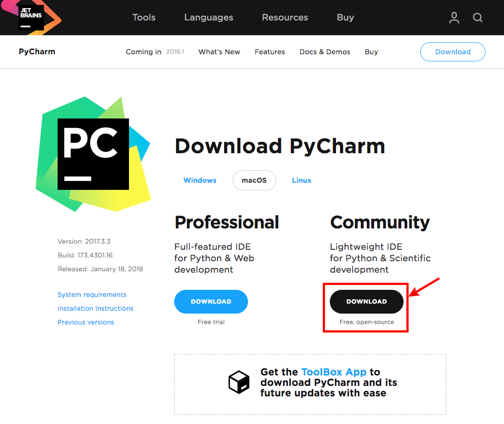

위 화면에서 해당하는 macOS를 선택하고, Community 버전을 선택합니다.

pycharm은 현재 몇가지 버전이 있고, 풀버전은 Professional 버전이나 이게 유료입니다. 하지만 누구나 사용할 수 있는 Community 버전은 무료인데도 풀버전의 대부분의 기능들을 지원하기 때문에, Community 버전으로도 코딩하는데 별 무리가 없습니다. 이제 막 파이썬에 입문하시는 분들은 일단 Community 버전으로 pycharm에 익숙해지신 이후에 유료버전으로 갈아타는 것을 추천드립니다!

(참고로 학생이신 분들은 무료로 Professional 버전을 사용할 수 있도록 JetBrains사에서 배려하고 있습니다!)


#### pycarm 설치

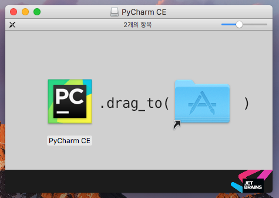

다운로드 받은 파이참 설치파일을 실행하면 다음과 같은 화면이 나옵니다. 간단하게 왼쪽 아이콘을 오른쪽 폴더로 드레그 해서 넣어 주면 파이참 설치가 완료됩니다.


#### pycharm 실행

이제 설치된 pycharm을 실행해 보도록 하겠습니다.

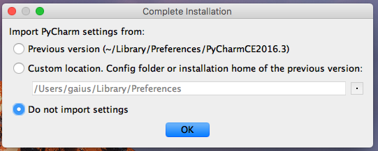

아마 pycharm을 처음으로 실행하면 위와같은 화면이 나오는데요. pycharm의 settings파일을 가지고 있다면 첫번째 버튼을 눌러서 pycharm settings를 한큐에 끝낼 수 있겠지만, 우리는 완전 처음하는 것이므로 그런 설정파일이 있을리 만무합니다. 미련없이 `Do not import settings` 선택하고 OK 누르시면 되겠습니다.


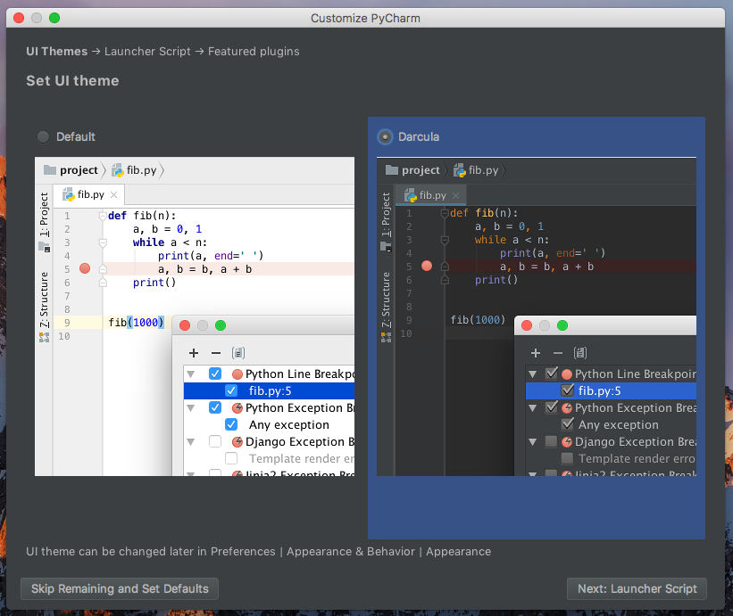

파이참의 스타일을 지정해주는 설정입니다. 큰 의미는 없고, 너는 하얀 화면이 좋니? 아님 까무잡잡한 화면이 좋니? 이런 의미입니다. 본인 기호의 맞게 선택해 줍니다. (저는 까무잡잡이 좋습니다.)


아직까지 스크립트가 필요없으므로 그냥 Next 버튼 눌러줍니다.


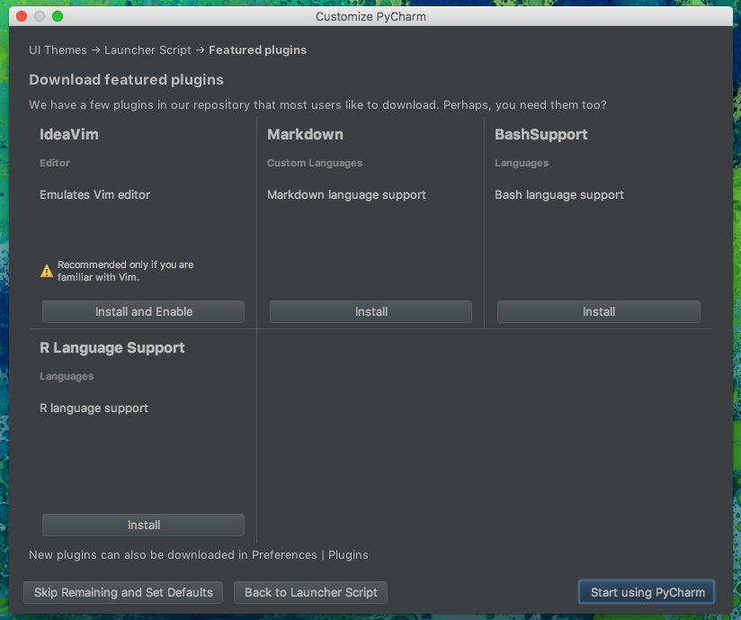

다음 화면으로 넘어가면 기본적인 플러그인을 설치할 수 있도록 하는 부분이 나옵니다. 이 부분은 그냥 지나쳐도 되나, Markdown(마크다운)은 많이 쓰기 때문에 하나 설치해주고 다음으로 가는 것을 추천합니다. 하지만 위 플러그인은 나중에 설정화면에서 언제든지 설치했다가 지웠다가 할 수 있는 부분이기 때문에 크게 신경쓰지 않으셔도 되겠습니다.


#### Project 시작!

위의 설정을 마무리하면 파이참이 실행되고 Project를 생성할 수 있습니다.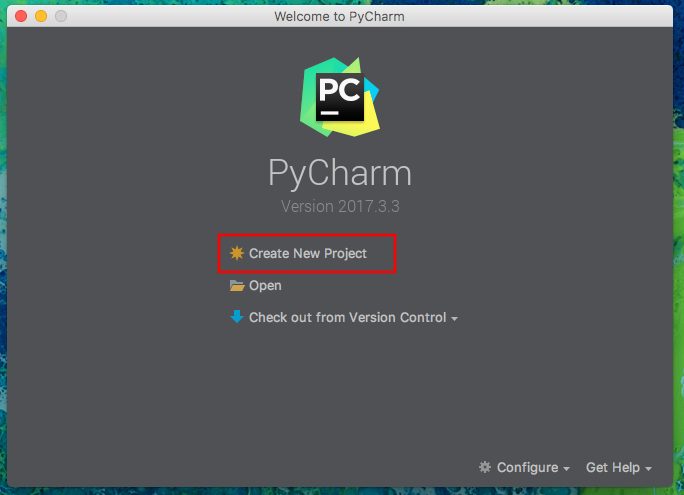

`Create New Project` 클릭!


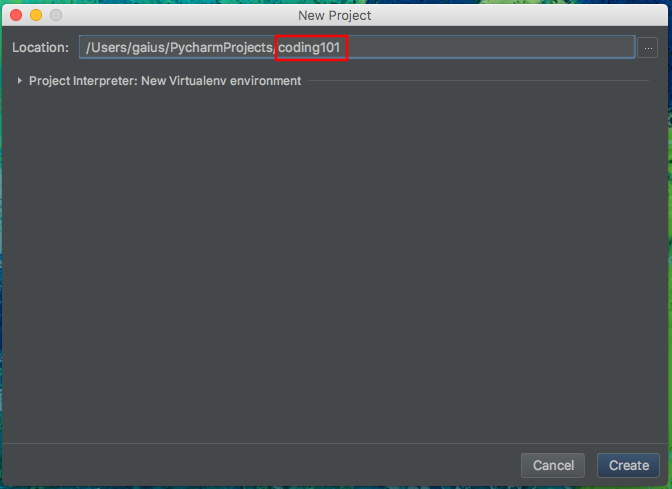

프로젝트 폴더명을 지정해 줍니다. 프로젝트 이름이 곧 프로젝트 폴더명이 될 것이기때문에 영문과 숫자 혹은 only 영문 형식으로 지어주시면 되겠습니다.(한글.. 가능하나 매우매우 추천하지 않습니다.)

그리고 이 화면에서 Project Interpreter 메뉴를 클릭해보면 다음과 같은 화면이 나옵니다.


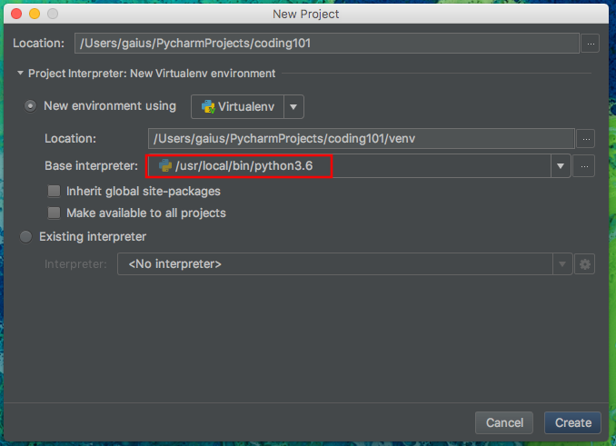

 <u>앞서 설치한 파이썬3와 이번에 설치한 파이참을 서로 연결</u>시켜주는 부분인데요. 위와 같이 앞서 설치한 파이썬3의 경로가 정확하게 나온다면 파이썬 설치도 제대로 된 것이고, 파이썬과 파이참이 순조롭게 연결이 된 것입니다. 아마 본 과정을 정확하게 따르셨다면 파이참이 알아서 파이썬의 경로를 인식했을 겁니다. 자동인식이기 때문에 파이썬이 3버전인지만 확인해주고 `Create` 진행하면 되겠습니다.


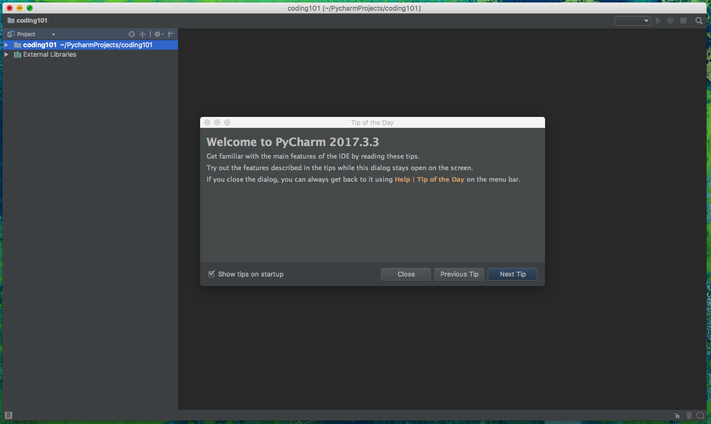

파이참 프로젝트 화면으로 멋지게 진입하였습니다! 오자마자 파이참 사용에 대한 Tip이 나오는데요. 이게 매일마다 바뀌니 초보분들은 Tip을 하나씩 보면서 파이참의 숨은 기능들을 익히는 것도 나쁘지 않을 겁니다.


#### pycharm terminal 사용법

파이썬 프로젝트 내에서 터미널을 사용하는 방법이 있습니다. 앞서 spotlight으로 터미널을 실행하고 또 터미널로 여러가지 설치도 해봤는데요. 그 터미널을 있는 그대로 파이참 내에서 사용하는 방법도 있습니다.


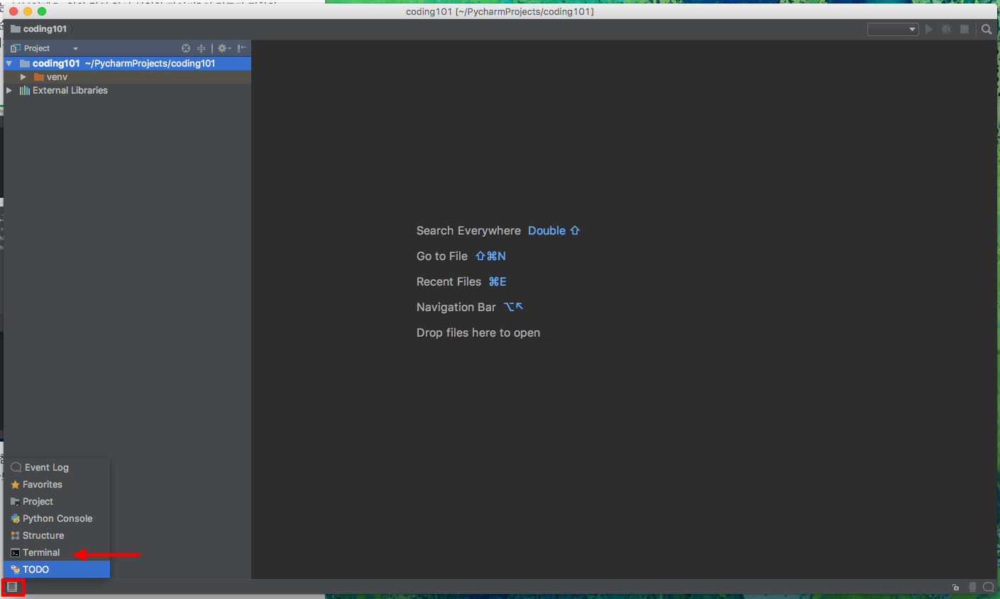

파이참 좌측 맨 하단에 네모 버튼을 눌러보시면 하단 창 화면을 무엇으로 할지 선택하는 드롭업? 버튼이 나오는데요. 거기서 terminal을 눌러줍니다.


그러면 이렇게 화면 하단이 terminal로 바뀌게 되고, 심지어는 실행경로가 딱 우리가 지정했던 프로젝트 경로와도 일치시켜 줍니다. 파이참을 사용하신다면 앞으로는 따로 터미널창을 키지말고 파이참 내에서 사용하는 것이 더 편리하겠지요!


## 코드를 쳐보고, 실행을 해보자

여기까지 오시느라 수고 많으셨습니다. 이제 본격적으로 코딩할 준비가 끝났습니다. 그럼 이 기세를 몰아 실제로 코드를 쳐보고 실행까지 후딱 해치워보도록 하겠습니다.

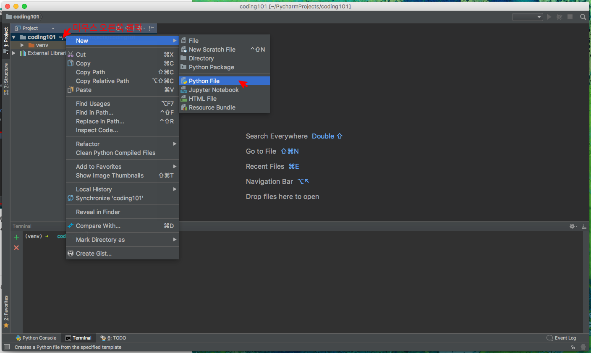

프로젝트 폴더에서 마우스 오른쪽버튼을 누르고 파이썬 파일 하나를 생성해 줍니다.


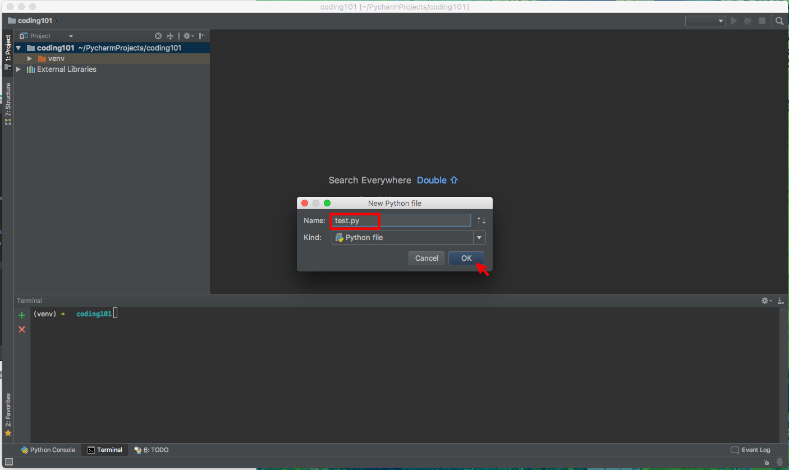

파이썬 파일명을 지정해주시고, 마지막은 항상 .py 확장자명을 가지도록 해줍니다. (저는 test.py로 이름 지었습니다.)


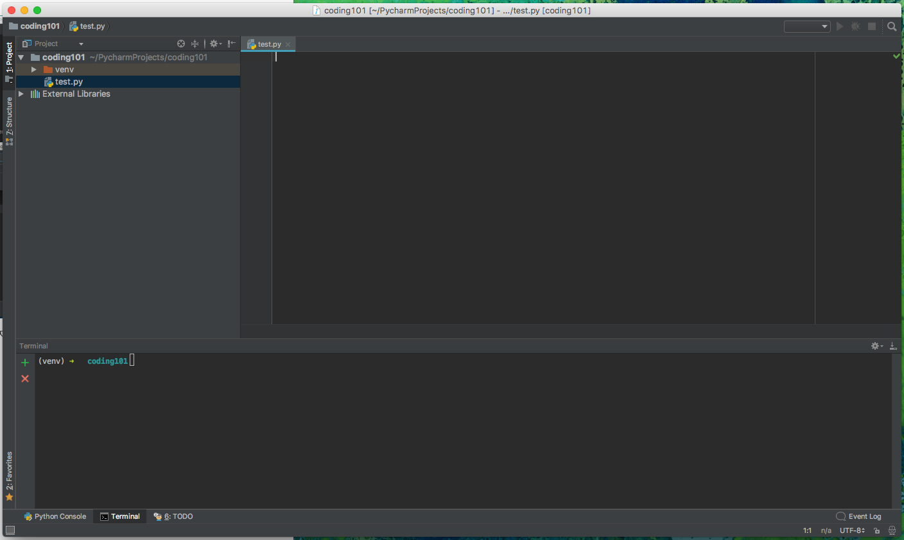

위와 같이 파이썬 파일이 하나 만들어진 모습과 그 파일을 편집할 수 있는 화면이 나옵니다.


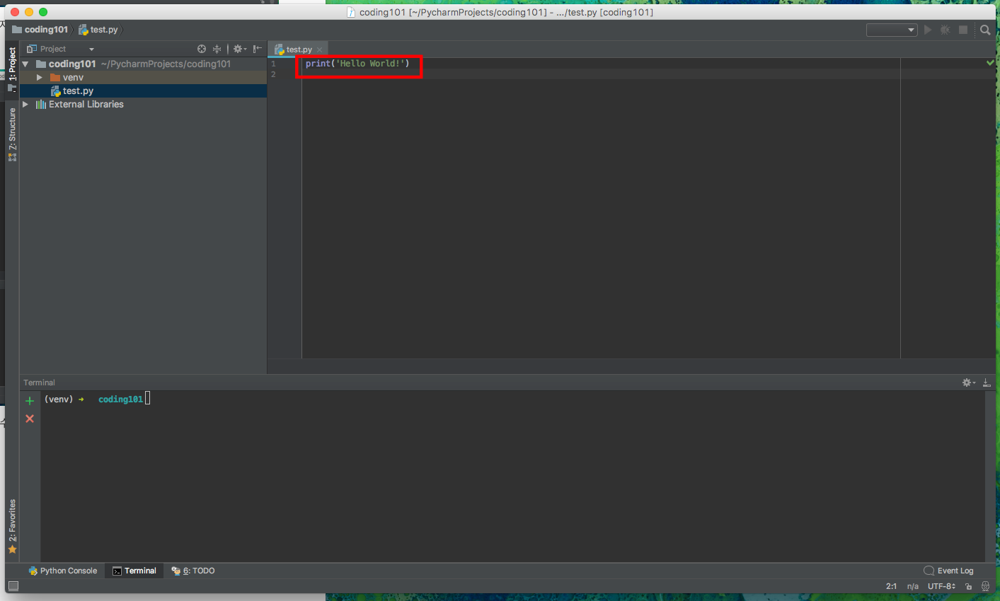

파이썬 파일 편집화면에 `print('Hello World!')`라는 파이썬 구문을 입력합니다.(참고로 위의 `print('Hello world')`라는 문법은 단순히 Hello world를 출력하라는 문법입니다.)


그리고 화면 하단부에 가서 바로 해당 파이썬 파일을 실행해 봅니다. (파이참은 자동저장 기능이 있어서 따로 저장할 필요 없이 바로 터미널에서 실행하면 됩니다.)

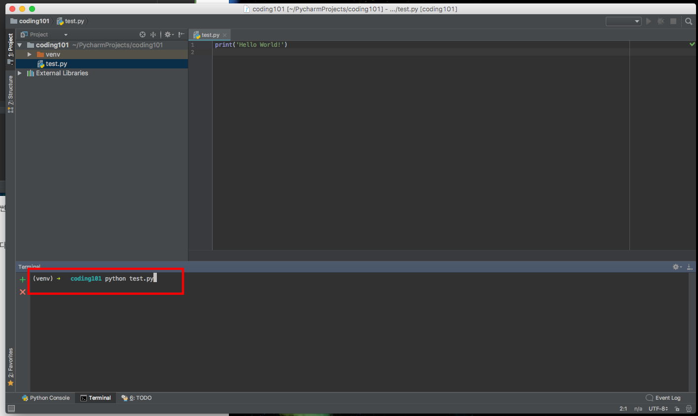

화면 하단 터미널에서 `python test.py` 입력 후 `enter`!!


방금 우리가 작성했던 `print('Hello world')`라는 구문이 출력된 모습입니다.


여기까지 Mac 환경에서 파이썬을 설치하고, 파이참을 설치하고 파이썬 파일을 실행하는 과정까지를 모두 진행하였습니다. 이제 파이썬과 관련된 환경이 정갈하게 정리되었으니, 이제부터는 파이썬 문법과 프로그래밍에 집중할 수 있을 것 같군요!


혹시 안되는 부분이나 궁금하신 사항이 있으시다면 gaius827@gmail.com 으로 문의주세요! 시간날때마다 답변해 드리겠습니다. 감사합니다!


